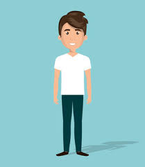

<!DOCTYPE html>
<html lang="en">

<head>
  <meta charset="UTF-8" />
  <meta name="viewport" content="width=device-width, initial-scale=1.0" />
  <title>My Resume Portfolio</title>
  <link href="https://fonts.googleapis.com/css2?family=Poppins:wght@300;600&display=swap" rel="stylesheet">
  
</head>

<body>
  <header>
    <nav>
      
<strong>My Resume</strong>

      

        <a href="#about">About</a>
        <a href="#skills">Skills</a>
        <a href="#projects">Projects</a>
        <a href="#education">Education</a>
        <a href="#statement">Reflection</a>
        <a href="#contact">Contact</a>
      

    </nav>
  </header>

  <section class="hero" id="about">
    
    <h1>Hello, I'm Sean Jesse L. Cabuntocan</h1>
    
A passionate IT student learning web development!

  </section>

  <section id="skills">
    <h2>Skills</h2>
    

      <ul>
        <li>HTML5, CSS3, JavaScript</li>
        <li>Responsive Web Design</li>
        <li>Basic Git & GitHub</li>
        <li>UI/UX Fundamentals</li>
        <li>Problem-Solving and Debugging</li>
      </ul>
    

  </section>

  <section id="projects">
    <h2>My Projects</h2>
    

      

        <h3>Simple Calculator</h3>
        
A basic calculator using HTML, CSS, and JavaScript.

      

      

        <h3>Personal Blog Layout</h3>
        
A static blog site with responsive design.

      

      

        <h3>Login Form</h3>
        
A user-friendly login form with input validations.

      

    

  </section>

  <section id="education">
    <h2>Education</h2>
    

      
<strong>Our Lady of Fatima University</strong>

      
Bachelor of Science in Information Technology

      
1st Year Student | 2025 - Present

    

  </section>

  <section id="statement">
    <h2>Personal Reflection</h2>
    

      

        As a first-year IT student, this journey into web development has been both challenging and rewarding to me. I have learned how to structure web pages, style them creatively, and even add interactivity using JavaScript. My projects show how much I've grown since the beginning of the semester. I aim to improve further by exploring backend technologies and creating full-stack applications. My goal is to become a versatile and creative web developer.
      

    

  </section>

  <section id="contact">
    <h2>Contact Me</h2>
    
📘 Facebook: Sean Cabuntocan

    
📧 Email: slcabuntocan0024qc@student.fatima.edu.ph

    
📱 Phone Number: 09949088059

    
🐱 GitHub: <a href="https://github.com/SeanCabuntocan0024" target="_blank">SeanCabuntocan0024</a>

  </section>

  <footer>
    &copy; 2025 Sean Jesse L. Cabuntocan | 1st Year IT Student | All rights reserved.
  </footer>
</body>

</html>
